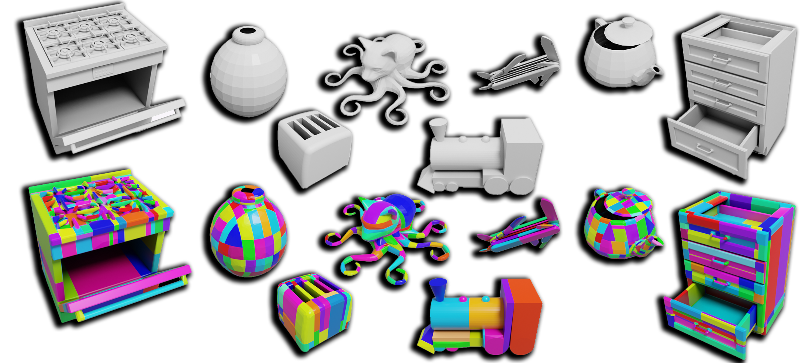
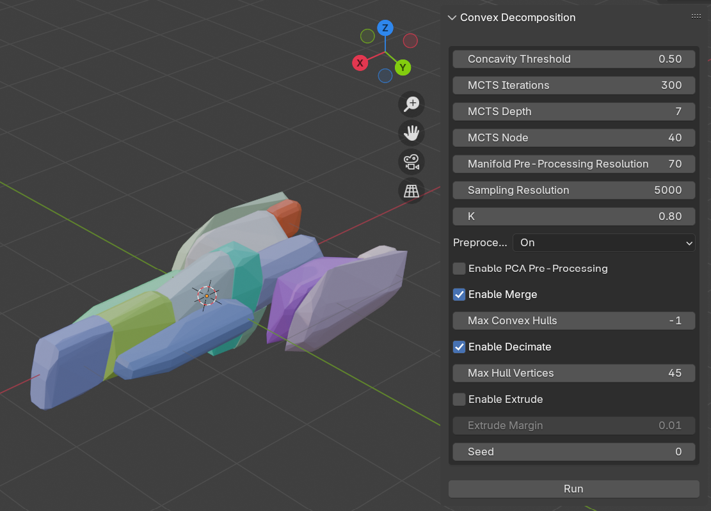

# Blender Plugin For Convex Decomposition using CoACD

This Blender addon makes [CoACD](https://github.com/SarahWeiii/CoACD) available inside Blender. 
CoACD is a state-of-the-art algorithm for approximate convex decomposition, enabling efficient geometry processing by breaking down complex shapes into convex components. 
This approach enhances collision detection and object interaction by preserving the original shape's collision properties with fewer components, ensuring both accuracy and efficiency in downstream applications.

## Installation
Grab (or build) the binaries for [CoACD](https://github.com/SarahWeiii/CoACD) from their repository.

Install the `convex_decomposition.py` addon like you would any other Blender addon and specify the path to the CoACD binaries in the preferences.

Now you should have a `ConvDecomp` panel in Blender's `N-menu`.

## Usage
Select an object, then press `Run`.

The solver may run for several minutes, during which progress from CoACD will be logged and summarized on the interface.
Click on the Blender log popup to display the full console output of CoACD. You can also cancel the operation at any time.

Afterwards, the convex hulls will appear in the scene and be parented to the original object. The addon will also place the shapes into a dedicated `convex hulls` collection to easily (un)hide all of them at once.

The shape names adhere to the [FBX convention](https://docs.unrealengine.com/4.27/en-US/WorkingWithContent/Importing/FBX/StaticMeshes/#collision) for Unreal.
Please refer to the official [CoACD](https://github.com/SarahWeiii/CoACD) site and paper for an explanation of the parameters.
